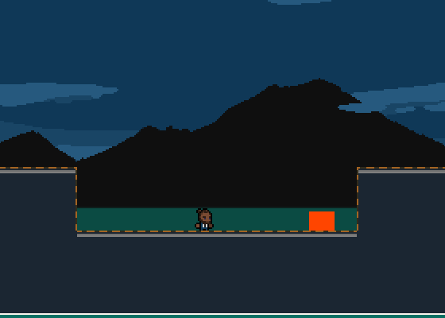
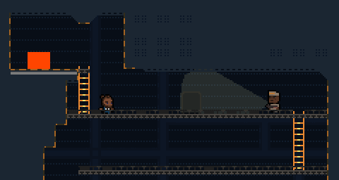

# Agent Obie

Finally feel ready to start the devlog for this! :D

Agent Obie is a 2D Action/Stealth Platformer inspired by Balding Quest and James Bond, which puts you in control of the super spy, Obie, and his arsenal of high tech gadgets. Obie has many gadgets at his disposal, but he cannot harm any of his enemies, you have to use clever tactics and gadgets to get past them.

Obie's gadgets currently include: an invisibility cloak, a time manipulation field, a flashbang grenade, and some more that I don't want to spoil yet.

This mission sees Obie entering Skovia to put a stop to Dr. Diabo's plans of invading the peaceful nation of Leftbrook. (Coming up with names is not a skill of mine)
 
_Developing  using Python, pygame, and Peachy (a custom python game framework that I plan on releasing open-source)._
Check out more of my development on [twitter](#) or [tumblr!](#)